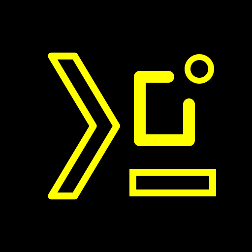

<div align="center">



# 白い熊 Termux GUI

**Native Android UI for your Termux command line — backed up, automated, and in the 白い熊 look.**

A fork of [Termux:GUI](https://github.com/termux/termux-gui) with **major additions**: the 白い熊 Termux GUI UI page, Export / Import of the app's settings, the sister-app backup-automation contract, the black-yellow traced icon and the 白い熊 name, and a reproducible signed build pipeline.

Installs **over** the stock Termux:GUI (app id `com.termux.gui` kept so the Termux package ecosystem keeps working); the whole family — Termux, Termux API, Termux X11, Termux GUI and 白い熊 GNU Emacs — shares Android UID `com.termux` and is signed with one key, so every member must come from these forks.

**📥 Latest release: [`1.0.0+2025-06-25.23-38.gbe24a5f3+002`](https://github.com/ShiroiKuma0/shiroikuma-termux-gui/releases/latest)** — [all releases & APK downloads »](https://github.com/ShiroiKuma0/shiroikuma-termux-gui/releases)

</div>

---

## 🐻 The 白い熊 Termux GUI UI page

Stock Termux:GUI has one settings screen and nothing else. This fork adds the house page every 白い熊
app carries — black background, yellow ink, pill buttons, bordered dialogs — reachable three ways:
**long-press the launcher icon** (a static shortcut, 「白い熊 UI」), **long-press the title** of the
settings screen, or tap the yellow **「白い熊 Termux GUI UI」 pill** placed right under that title.
The page holds the Export / Import section, the backup-automation rows, and a Reset row for its
own settings.

---

## 📦 Export / Import of the settings

Back the app up as **one ZIP** — `shiroikuma-termux-gui_<yyyy-MM-dd_HH-mm-ss>.zip` — into a directory
you choose once (a Storage Access Framework tree, so the app needs no storage permission), and
restore from any backup in it. The panel shows the directory (red until set), the newest backup,
全選択 and a checkbox per category, and the pills Cancel · Import · Export. The one category is the
app's four settings (service timeout, background, log level, the JavaScript prompt), which live in
Termux:GUI's *encrypted* preferences — they are dumped and restored through the very handle the
app itself uses. An import merges per key and ends with a 「Restart now」 offer; the JavaScript
prompt is **tighten-only** — a backup may switch the prompt back on, never off.

---

## 🤖 Backup automation for the sister apps

The 保存復元 batch of 自由作業盤 and the app manager 応用管理 can back this app up without a tap,
through the family's **automation contract v2**: an `EXPORT_STATE` / `LIST_CATEGORIES` /
`CANCEL_EXPORT` receiver that writes into the export directory, and the data door
`content://com.termux.gui.automation` (describe · export · import · cancel) that streams the
archive through a caller-supplied descriptor. Every caller of the data door is verified by exact
package name, kernel uid **and pinned signing certificate**; the work runs in `dataSync` foreground
services with real progress broadcasts and exactly one terminal reply. The 「Automation export」
switch is on by default and an authorization token is opt-in, so a freshly restored phone can be
backed up before anything is configured.

---

## 🎨 The traced icon and the name

The launcher icon is the 白い熊 signature — **yellow `#FFFF00` line art on black**: the chevron, the
open window frame with its dot, and the underscore of the upstream mark, redrawn as strokes. It is
generated from one geometry model by `tools/icon/emit_launcher.py` into the adaptive foreground,
every mipmap density, the Play-store PNG and the SVG under `design/`. The app calls itself
**白い熊 Termux GUI** everywhere a user can see it — launcher, settings title, the service
notification, the logcat dump, the permission toasts, the store metadata — while the protocol,
the package and the code namespaces stay exactly upstream's.

---

## 🔑 One family, one key — and the id stays `com.termux.gui`

Every Termux:GUI client — the Python, C and Bash bindings and each program built on them —
broadcasts to `com.termux.gui/.GUIReceiver` and connects to that package's socket, and the app
must share UID `com.termux` with Termux to read your files. So the package id is deliberately
**not** renamed: this build **upgrades stock Termux:GUI in place** (same id, higher versionCode,
the family key) and is told apart by its label, icon, links and the UI page. Because the whole
`com.termux` shared UID must carry one signature, it goes together with the other members:

- [shiroikuma-termux](https://github.com/ShiroiKuma0/shiroikuma-termux) — 白い熊 Termux (`com.termux`)
- [shiroikuma-termux-api](https://github.com/ShiroiKuma0/shiroikuma-termux-api) — 白い熊 Termux API (`com.termux.api`)
- [shiroikuma-termux-x11](https://github.com/ShiroiKuma0/shiroikuma-termux-x11) — 白い熊 Termux X11 (`com.termux.x11`)
- [shiroikuma-termux-gui](https://github.com/ShiroiKuma0/shiroikuma-termux-gui) — 白い熊 Termux GUI (`com.termux.gui`, this repo)
- [shiroikuma-emacs](https://github.com/ShiroiKuma0/shiroikuma-emacs) — 白い熊 GNU Emacs (`shiroikuma.emacs`, side-by-side with stock `org.gnu.emacs`)

---

## 🔧 A reproducible signed build

`./gradlew buildFork` builds the signed release APK, names it after the exact upstream commit it is
built on, copies it to `~/tmp/` and bumps the build counter — refusing to ship unsigned, to reuse a
versionCode, or to overwrite an earlier build. The version reads
`<upstream version>+<upstream base date>.<HH-MM>.g<sha8>+<NNN>`: the fork tracks upstream's branch
tip, so the pin says which upstream commit a release carries, and `versionCode` is upstream's
code × 10000 + N.

---

## Built on Termux:GUI

A fork of [termux/termux-gui](https://github.com/termux/termux-gui) (app id `com.termux.gui` kept,
so it replaces the official build and every client keeps working). Termux:GUI is the Termux plugin
that lets command-line programs draw native Android UI over a Unix socket — buttons, layouts,
notifications, widgets, WebViews, shared image buffers and GLES2 — and this fork changes nothing
about that protocol. The code remains under the [GPL-3.0](LICENSE).

## Building

Needs JDK 21, the Android SDK with `compileSdk 34`, NDK `23.1.7779620` and CMake (the JNI library),
plus the `sources;android-34` package that upstream's `preBuild` task reads.

```bash
git clone https://github.com/ShiroiKuma0/shiroikuma-termux-gui.git
cd shiroikuma-termux-gui                   # branch custom
export JAVA_HOME=/usr/lib/jvm/java-21-openjdk-amd64
export ANDROID_HOME="$HOME/android-sdk"    # or sdk.dir=… in local.properties

# Signed release APK → ~/tmp/shiroikuma-termux-gui_<versionName>_universal.apk, then BUILD_NUMBER is bumped
./gradlew buildFork --console=plain

# Release APK only (no copy, no bump) → app/build/outputs/apk/release/app-release.apk
./gradlew :app:assembleRelease --console=plain
```

`buildFork` signs from a `keystore.properties` at the repo root (gitignored; copy
`keystore.properties_sample` and point it at your keystore) and refuses to run without it. Note that
the release must be signed with the **same key as every other member of the `com.termux` shared
UID** on the device, or Android rejects the install with `INSTALL_FAILED_SHARED_USER_INCOMPATIBLE`.
`BUILD_NUMBER` in `gradle.properties` is the per-build counter; it only ever goes up. A release
build also rewrites upstream's tracked R8 by-products `app/mapping.txt`, `app/seeds.txt` and
`app/usage.txt` — restore them with `git checkout -- app/mapping.txt app/seeds.txt app/usage.txt`
rather than committing them. If `sdkmanager` cannot reach the network, `GITHUB_ACTIONS=1` skips
upstream's source-fetching `preBuild` tasks (the committed protocol file is already current).

---

*Upstream's own README follows.*

# Termux:GUI

[](https://github.com/ShiroiKuma0/shiroikuma-termux-gui/releases)
[](https://f-droid.org/de/packages/com.termux.gui/)


This is a plugin for [Termux](https://github.com/termux/termux-app) that enables command line programs to use the native android GUI.  
  
In the examples directory you can find demo videos, sample code is provided in the tutorials of the official language bindings.

[There are also prepackaged programs you can use](https://github.com/tareksander/termux-gui-package). The `termux-gui-package` package contains a collection of small programs.

See the [installation notes](https://github.com/termux/termux-app#installation) on general instructions to install Termux plugins. Clicking on the F-Droid badge above brings you to the F-Droid page for the plugin, the release badge to the GitHub releases.

If you want to use overlay windows or be able to open windows from the background, go into the app settings for Termux:GUI, open the advanced section and enable "Display over other apps".  

For developing applications using the plugin, see [Developing.md](./Developing.md).

### Features

- buttons, switches, toggles, checkboxes, text fields, scrolling, LinearLayout
- custom notifications
- custom widgets
- shared image buffers
- GLES2 acceleration
- WebView
- Dialogs
- Lockscreen Activities
- Wake-lock
- ...and more


### Comparison with native apps

| Native app                                                | With Termux:GUI                                                             |
|-----------------------------------------------------------|-----------------------------------------------------------------------------|
| Has to be installed                                       | Program can be run in Termux                                                |
| Full access to the Android API                            | Access to the Android API through Termux:GUI and Termux:API                 |
| Limited to C, C++, Kotlin and Java for native development | Any programming language can be used, prebuilt library for python available |
|                                                           | Lower performance caused by IPC                                             |
| Accessing files in Termux only possible via SAF           | Direct access to files in Termux                                            |
| Has to be started with `am` from Termux                   | Can be started like any other program in Termux                             |
|                                                           | Can receive command line arguments and output back to the Terminal          |


## Language Bindings

### Official

- [Python](https://github.com/tareksander/termux-gui-python-bindings)
- [C/C++](https://github.com/tareksander/termux-gui-c-bindings)
- [Bash](https://github.com/tareksander/termux-gui-bash)

### Community

Not maintained by the plugin maintainer:

- [Rust](https://github.com/sweetkitty13/tgui-rs)

